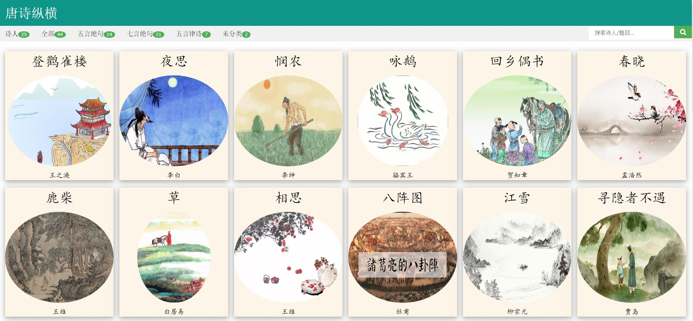
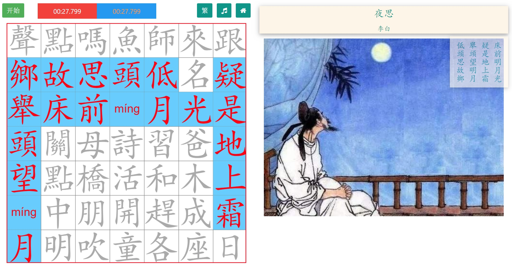

## CrossPoem

A "crossword" puzzle to find Chinese poem in the grid horizontally, vertically or diagonally.

### Demo
#### Index Page
- Catetory by Type, Author
- Support search by Title, Author

#### Game Page
- Start: new game
- Timer and best time
- Toggle between simplied/traditional Chinese
- Click character to show Pinyin
- Play poem recording

## 诗词纵横

在汉字方格迷宫中寻找完整的一首诗。诗句可以是横向、纵向或对角线方向。

### 展示
#### 目录页
- 诗词菜单（按类别，作者）
- 关键字搜索（按题目，作者）

#### 游戏页
- 开始:生成新的汉字迷宫
- 计时器，记录最少用时
- 汉字简繁体转换 
- 诗词朗诵音频
- 点击汉字显示拼音

#### Reference
- pinyin4js: [github](https://github.com/superbiger/pinyin4js)
- MakeMeHanzi:  [github](https://github.com/skishore/makemeahanzi), [webiste](https://www.skishore.me/makemeahanzi/)
- HanziWriter : [github](https://github.com/chanind/hanzi-writer), [website](https://chanind.github.io/hanzi-writer/)
- Discussions
  - [stroke order database](https://chinese.stackexchange.com/questions/14101/stroke-order-database)
