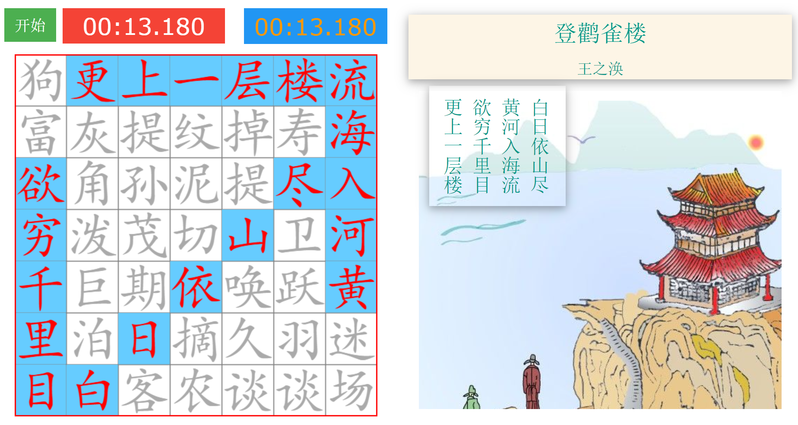

## CrossPoem

To find the poem hidden in the grid horizontally, vertically or diagonally.

### Snapshot

#### Reference
- MakeMeHanzi:  [github](https://github.com/skishore/makemeahanzi), [webiste](https://www.skishore.me/makemeahanzi/)
- HanziWriter : [github](https://github.com/chanind/hanzi-writer), [website](https://chanind.github.io/hanzi-writer/)
- Discussions
  - [stroke order database](https://chinese.stackexchange.com/questions/14101/stroke-order-database)
